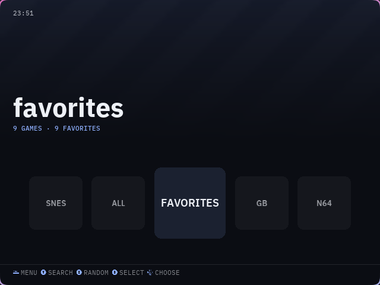
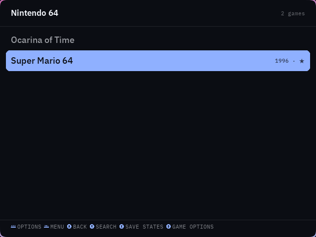
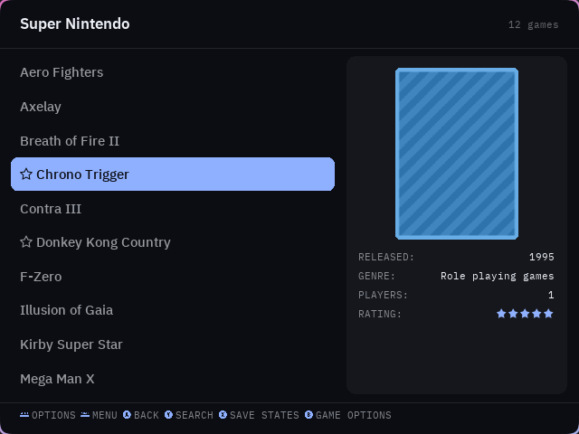
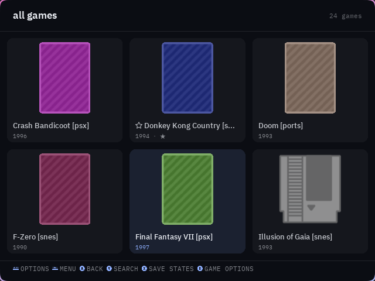
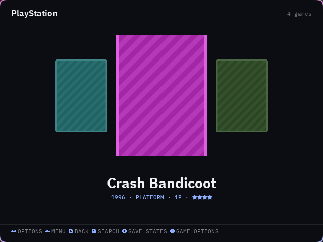
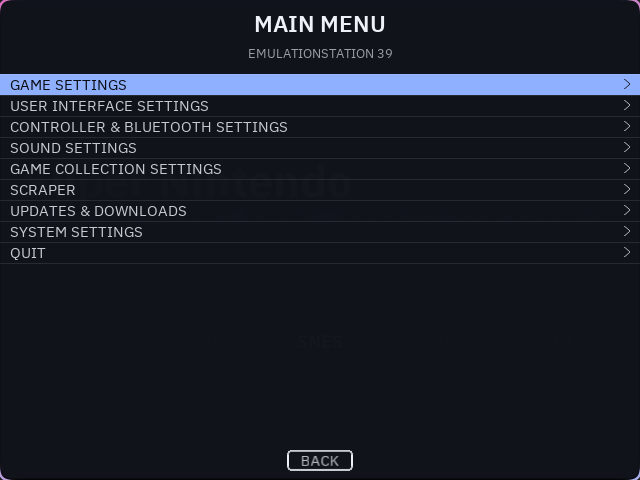

# RelicOS EmulationStation theme

The stock look of [RelicOS](https://github.com/RelicOS) on the R36S: a dark,
cinematic panel at the device's native **640x480**, IBM Plex type, one blue
accent. Built for batocera-emulationstation (the KNULLI fork RelicOS ships),
theme format version 7.

Design source: Claude Design project "Tema R36S", turn 3 (options 3a, 3b, 3c).

## Screens

Screenshots from the host preview (see `tools/host-preview/`), placeholder
covers, no system art:

| View | What it is | Design |
|---|---|---|
| `system`  | Hero art for the system, its full name in 46px, "N GAMES · M FAVORITES", and a rail of five tiles. The selected tile is bigger and framed in the accent colour. | 3a, screen 1 |
| `basic`  | Names only, nine 42px rows. The selected row becomes a solid accent block and shows the year (and a ★ for favourites) on the right. | 3a, screen 2 |
| `detailed`  | The same list on the left, a panel on the right with the box art and a four-row table: year, genre, players, rating. | 3a, screen 3 |
| `grid`  | Six cover cards per screen (3x2), name and year under each cover. | 3b |
| `gamecarousel`  | One large cover in the middle with a dimmed neighbour each side; title and a "YEAR · GENRE · 1P · ★★★★★" line below. | 3c |
| `menu`  | The ES menus in the same palette. | — |

The games-page layout is the user's choice: **MAIN MENU → UI SETTINGS →
GAMELIST VIEW STYLE** (`automatic`, `basic`, `detailed`, `grid`,
`gamecarousel`), or per system from that system's view options. `automatic`
picks `basic` when the system has no images and `detailed` when it does.

## Layout of the repository

```
theme.xml            palette, fonts, type scale, includes
views/chrome.xml     header / footer / help style shared by the games pages
views/system.xml     system view
views/basic.xml      views/detailed.xml  views/grid.xml  views/gamecarousel.xml
views/menu.xml       ES menus in the same palette
splash.xml           the ES's loading screen (logo + progress bar)
gamesplash.xml       the screen shown while a game boots (cover + name).
                     Both are read straight from the theme root by the ES,
                     not included from theme.xml, so they repeat the palette
art/white.png        the one bitmap every tinted rectangle is made of
art/logo.png         the RelicOS mark, cut out of the boot splash artwork
                     by tools/crop-logo.py
art/systems/         hero art, one PNG per <theme> name from es_systems.cfg
                     (default.png is the placeholder)
art/icons/           battery glyphs (SVG)
art/fonts/           IBM Plex (not committed; see below)
tools/               asset generator and font fetcher
```

Coordinates in the XML are `px/640` for x and `px/480` for y. Font sizes are
`px/480/1.31`: the ES multiplies every theme font by 1.31 on screens under
720px, so the type scale in `theme.xml` is pre-divided. Radii and border
widths ≥ 1 are pixels.

## Fonts

The theme references IBM Plex Sans (Regular, Medium, SemiBold, Bold) and
IBM Plex Mono (Regular, Medium), licensed under the SIL Open Font License.
They are not in this repository yet. Fetch them once:

```sh
tools/fetch-fonts.sh
```

Without the files EmulationStation falls back to its bundled fonts, so the
theme still loads, just not in Plex.

## Previewing on a PC

```sh
tools/host-preview/preview.sh
```

Builds the RelicOS ES fork for x86 on first use (needs `nix`), then opens it
in a 640x480 window with fake systems and games. Esc is OK, Enter is back,
F5 reloads the theme. Details in `tools/host-preview/host-preview.md`.

## Installing on a build

RelicOS reads theme sets from `/usr/share/emulationstation/themes` (system
themes, immutable) and `/relic/themes` (user themes). Install this folder as
`themes/relicos/` in either place; the theme set name shown in UI SETTINGS
is the folder name.

## Adding system art

Drop a 640x240 (or larger, same 8:3 ratio) PNG at
`art/systems/<theme>.png`, where `<theme>` is the `<theme>` tag of the
system in `es_systems.cfg` (`gb`, `snes`, ...). It is cropped to fill the
top half of the system view and darkened towards the bottom. A per-system
logo can replace the text tile the same way: uncomment the `logo` element in
`views/system.xml` and add `art/logos/<theme>.svg`.

## Status

Written against the pinned ES source (KNULLI fork, commit `f7c5ae10`) and
verified on a PC with that exact fork built for x86, in a 640x480 window
(`tools/host-preview/host-preview.md`). All five views and the menus render
as designed there. Not yet observed on the device. Things to check first on
real hardware:

- the `rectangle` element and `roundCorners` on the GLES2 path (the host
  uses desktop OpenGL);
- row and card templates (`itemTemplate`) scrolling smoothly on the A35;
- the battery icon (the host has no battery, so it was never drawn).

Known gaps against the design: the help bar uses the ES's button glyphs
rather than bare letters; the carousel's page dots do not exist in the ES;
covers in `gamecarousel` keep square corners; the metadata labels come from
the ES's own translations, with a trailing colon; the selected system tile
is 108px rather than 124px, because the carousel clips to its own bounds
and the band has to be at least five times the selected tile wide (see the
note at the top of `views/system.xml`).

Three more things found by measuring the host's output:

- **`rectangle` never draws its border.** `color` works, `borderColor` and
  `borderSize` are read and then never reach the screen. A ring has to be
  drawn as the gap between two filled rounded rectangles, which is what the
  system tiles do. The borders in `views/grid.xml` and `views/detailed.xml`
  are still written the old way and are therefore invisible.
- **`rectangle` ignores `opacity`**, so it cannot be cross-faded either.
- **A templated `rating` cannot be given a value.** The ES applies a bound
  float through `GuiComponent::setProperty`, which handles pos, size,
  opacity, scale and a few more, but not `value` - so inside an
  `itemTemplate` the rating always draws as empty. `views/grid.xml` lays
  the U+F005 glyphs over the U+F006 ones instead. As a normal view element
  (`md_rating`) the component works, and it draws the empty stars first
  and the filled part over them, so `views/detailed.xml` and
  `views/gamecarousel.xml` use it.
- **`rating` has no centre alignment.** `horizontalAlignment` only knows
  left and right; anything else falls through to left. Giving the element
  a width of 0 makes the ES size it to exactly five stars, which is what
  centring it on something else needs.
- **Rounded corners come out faceted on the host.** `Renderer::createRoundRect`
  computes `pieces = min(3, max(radius/3, 8))`, which is always 3, so every
  corner is three straight segments. The host (desktop GL) always takes that
  stencil path; the device's GLES2 renderer can take the shader path instead
  (`shaderSupportsCornerSize`), where the radius is a real uniform. So the
  blocky corners on rows and cards in the host preview may not be there on
  the R36S - worth a look on hardware before changing any radius.

Carousels have one rule worth writing down: **slot spacing is always
`size / maxLogoCount`, and the carousel clips to its own bounds**. The band
is therefore a consequence of the tile size, not a free choice, and a rail
that should run off the screen edges needs a band wider than the screen
(`views/system.xml` and `views/gamecarousel.xml` both do this).

What a theme can do to the ES menus is narrow: fonts, colours, the selector
bar, the row separator, the background, the scrollbar and the art for
switches, sliders and buttons. Menu width, the 10px horizontal padding and
full-screen menus on short screens are all compiled in, and a row is exactly
as tall as the tallest thing in it - so row height is set by the `menutext`
font size and nothing else. See the note at the top of `views/menu.xml`.
